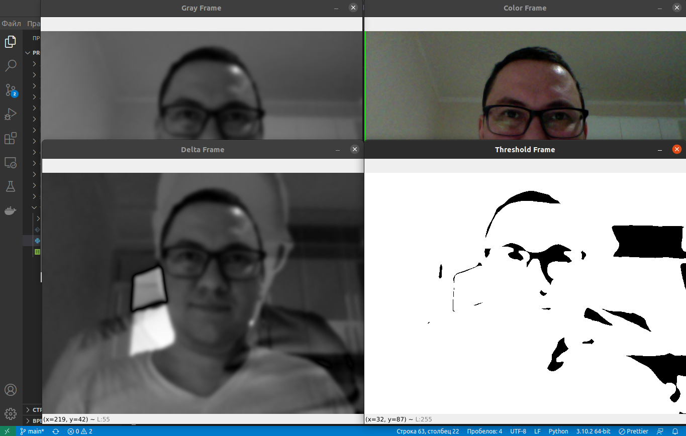

# Controlling the Webcam and Detecting Objects

 
 

<h1 align="center">
    
</h1>

    
    
    

- Python 3
- OpenCV
- Pandas

---

# Installation on Linux and Unix like OS

- `git clone https://github.com/lenargasimov/webcam-motion-detector.git`
- `cd webcam-motion-detector`
- `python3 main.py`

# Instalation on Windows

- `git clone https://github.com/lenargasimov/webcam-motion-detector.git`
- `cd webcam-motion-detector`
- `python main.py`
